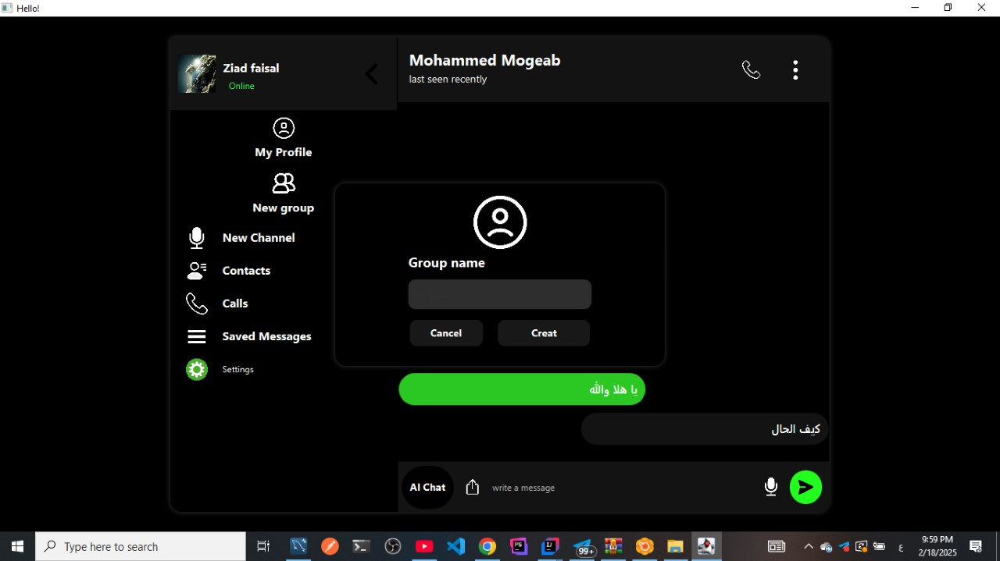

### 📌 Team Workflow & Contribution Rules

As a team working on this Chat App, we follow these collaboration rules to keep our project organized, efficient, and conflict-free.

---

#### ✅ 1. Pull Before You Push

> Before pushing any changes, always pull the latest code.

```bash
git pull origin main
```

- This ensures you are working with the latest version of the code.
- Avoids merge conflicts caused by outdated local changes.

---

#### 🌿 2. Create a Branch for Each Feature

> Never work directly on the `main` branch.

- Create a new branch for each feature, bug fix, or improvement.

**Branch Naming Convention:**
```
feature/your-feature-name
bugfix/fix-description
enhancement/improvement-name
```

**Example:**
```bash
git checkout main
git pull origin main
git checkout -b feature/group-chat-ui
```

Push with:
```bash
git push -u origin feature/group-chat-ui
```

---

#### 🔀 3. Use Pull Requests (PRs)

> All changes must be submitted via a pull request.

- Once your work is ready, create a **Pull Request** from your feature branch to `main`.
- Add a clear title and description.
- Assign it to the **team leader** for review.
- Wait for approval before merging.

---

#### 🧠 4. Use GitHub Project Board

We use a [GitHub Project Board](https://github.com/users/MohammedMogeab/projects/2/views/1) to manage tasks.

- Tasks move through stages: `To Do` → `In Progress` → `Done`.
- Each feature/issue should be tracked and linked to a PR.

---

#### 📌 5. Write Clear Commit Messages

> Describe what you did in each commit.

**Examples:**
```
Add group chat feature with UI support
Fix null pointer bug in login screen
Improve responsiveness of message list
```


### 🖼️ UI/UX Screenshots of Chat App

Here are design previews for our Chat App:



